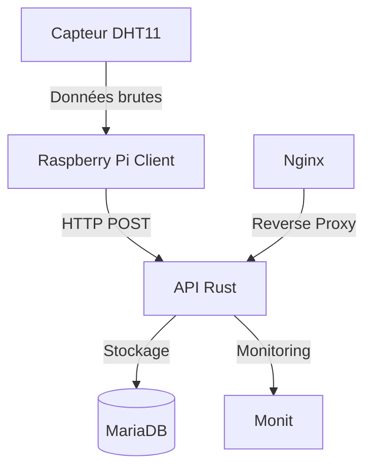

# Système de Monitoring Météo 🌡️

<div align="center">

[](https://www.rust-lang.org/)
[](https://actix.rs/)
[](https://mariadb.org/)
[](https://nginx.org/)
[](https://www.raspberrypi.org/)

Un système de monitoring météorologique moderne alliant performance et fiabilité

[🚀 Installation](#-installation) •
[📖 Documentation](#-documentation) •
[🛠️ Configuration](#%EF%B8%8F-configuration) •
[🤝 Contribution](#-contribution)

</div>

## 📑 Table des matières

- [🌟 Caractéristiques](#-caractéristiques)
- [🏗️ Architecture](#%EF%B8%8F-architecture)
- [🚀 Installation](#-installation)
- [⚙️ Configuration](#%EF%B8%8F-configuration)
- [📡 API Reference](#-api-reference)
- [🔧 Maintenance](#-maintenance)
- [💻 Développement](#-développement)
- [🐛 Dépannage](#-dépannage)

## 🌟 Caractéristiques

- **Performance Optimale**
  - ⚡ Backend ultra-rapide en Rust
  - 🔄 Traitement asynchrone des requêtes
  - 📊 Mise en cache optimisée

- **Surveillance Complète**
  - 📈 Monitoring en temps réel
  - 🌡️ Mesures de température précises
  - 💧 Suivi de l'humidité
  - 📍 Support multi-localisation

- **Sécurité**
  - 🔒 Système de permissions granulaire
  - 🛡️ Protection contre les attaques DDOS
  - 🔐 Chiffrement des communications

## 🏗️ Architecture



## 🚀 Installation

### Prérequis Système

```bash
# Mise à jour du système
sudo apt update && sudo apt upgrade -y

# Installation des dépendances
sudo apt install -y \
    pkg-config \
    libssl-dev \
    mariadb-server \
    nginx \
    monit \
    build-essential \
    git
```

### Base de données

```sql
-- Connexion à MariaDB
sudo mysql -u root -p

-- Création de la base et des privilèges
CREATE DATABASE meteo_db;
CREATE USER '<db_name>'@'localhost' IDENTIFIED BY '<password>';
GRANT ALL PRIVILEGES ON meteo_db.* TO '<db_name>'@'localhost';
FLUSH PRIVILEGES;

-- Structure de la base
USE meteo_db;
CREATE TABLE measurements (
    id INT AUTO_INCREMENT PRIMARY KEY,
    temperature FLOAT NOT NULL,
    humidity FLOAT NOT NULL,
    timestamp TIMESTAMP NOT NULL DEFAULT CURRENT_TIMESTAMP,
    location VARCHAR(50) NOT NULL DEFAULT 'interior'
);
```

### Installation du Serveur

```bash
# Clone du repository
git clone https://github.com/LukaChassaing/meteo_api_server.git
cd meteo-monitoring

# Compilation
cargo build --release

# Installation
sudo ./install.sh
```

## ⚙️ Configuration

### Variables d'Environnement

```env
# /opt/meteo-server/config.env
DATABASE_URL=mysql://<db_name>:<password>@localhost/meteo_db
PORT=<port>
RUST_LOG=info
```

### Configuration Nginx

```nginx
# /etc/nginx/sites-available/meteo-server
server {
    listen 80;
    server_name meteo.votredomaine.com;

    location / {
        proxy_pass http://localhost:<port>;
        proxy_http_version 1.1;
        proxy_set_header Upgrade $http_upgrade;
        proxy_set_header Connection 'upgrade';
        proxy_set_header Host $host;
        proxy_cache_bypass $http_upgrade;
    }
}
```

### Configuration Monit

```bash
# /etc/monit/conf.d/meteo-server
check process meteo-server with pidfile /var/run/meteo-server.pid
    start program = "/bin/systemctl start meteo-server"
    stop program = "/bin/systemctl stop meteo-server"
    if failed host localhost port <port> protocol http
        and request "/measurements"
        with timeout 10 seconds
        then restart
```

## 📡 API Reference

### Endpoints disponibles

| Méthode | Endpoint | Description | Authentification |
|---------|----------|-------------|------------------|
| POST | `/push-measures` | Envoie de nouvelles mesures | ✅ |
| GET | `/measurements` | Liste toutes les mesures | ❌ |
| GET | `/measurements/{location}` | Mesures par localisation | ❌ |
| GET | `/stats` | Statistiques globales | ❌ |

### Exemples d'utilisation

#### Envoi de mesures

```bash
curl -X POST http://localhost:<port>/push-measures \
  -H "Content-Type: application/json" \
  -d '{
    "temperature": {
      "value": 23.5,
      "unit": "°C"
    },
    "humidity": {
      "value": 65.0,
      "unit": "%"
    },
    "location": "interior"
  }'
```

#### Récupération des statistiques

```bash
curl http://localhost:<port>/stats
```

## 🔧 Maintenance

### Commandes Essentielles

```bash
# Statut des services
sudo systemctl status meteo-server
sudo systemctl status nginx
sudo monit status

# Logs
sudo journalctl -u meteo-server -f
sudo tail -f /var/log/nginx/error.log

# Backup de la base
mysqldump -u root -p meteo_db > backup_$(date +%Y%m%d).sql
```

### Tâches de Maintenance Régulières

| Période | Action | Commande |
|---------|--------|----------|
| Quotidien | Vérification des logs | `sudo journalctl -u meteo-server --since "24h ago"` |
| Hebdomadaire | Backup base de données | `mysqldump -u root -p meteo_db > backup.sql` |
| Mensuel | Purge des anciennes données | `mysql -u root -p meteo_db < cleanup.sql` |

## 💻 Développement

### Structure du Projet

```
meteo-monitoring/
├── src/
│   ├── main.rs         # Point d'entrée
│   ├── models.rs       # Modèles de données
│   ├── handlers.rs     # Gestionnaires de routes
│   └── db.rs          # Interactions base de données
├── config/
│   ├── nginx/         # Configuration Nginx
│   └── monit/         # Configuration Monit
└── scripts/
    ├── install.sh     # Script d'installation
    └── backup.sh      # Script de sauvegarde
```

### Tests

```bash
# Tests unitaires
cargo test

# Tests d'intégration
cargo test --test '*'

# Benchmarks
cargo bench
```

## 🐛 Dépannage

### Problèmes Courants

| Problème | Cause Possible | Solution |
|----------|----------------|----------|
| `Connection refused` | Service non démarré | `sudo systemctl start meteo-server` |
| `Permission denied` | Droits insuffisants | `sudo chown -R meteo:meteo /opt/meteo-server` |
| Erreurs DHT11 | Câblage incorrect | Vérifier les connexions GPIO |

### Outils de Diagnostic

```bash
# Vérification réseau
netstat -tulpn | grep meteo-server

# Test de la base de données
mysqlshow -u <db_name> -p meteo_db

# Surveillance ressources
htop
```

## 🤝 Contribution

Nous accueillons toutes les contributions ! Voici comment participer :

1. Forkez le projet
2. Créez votre branche (`git checkout -b feature/AmazingFeature`)
3. Committez vos changements (`git commit -m 'Add AmazingFeature'`)
4. Pushez sur la branche (`git push origin feature/AmazingFeature`)
5. Ouvrez une Pull Request

## 📄 Licence

Ce projet est sous licence [GNU GPL v3](LICENSE).

---

<div align="center">

**[⬆ Retour en haut](#système-de-monitoring-météo-️)**

Fait avec ❤️ par Luka Chassaing

</div>